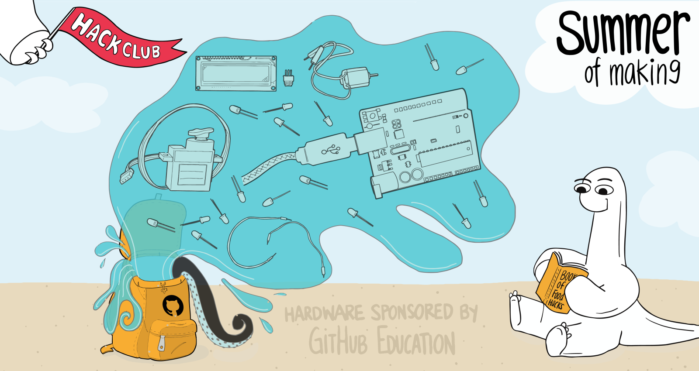
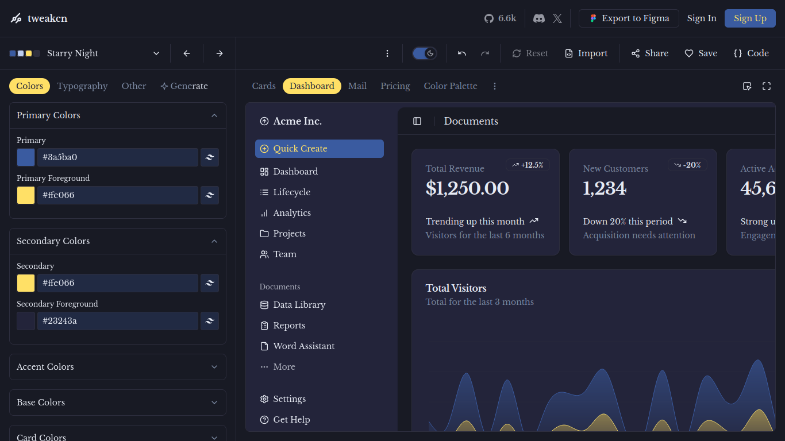
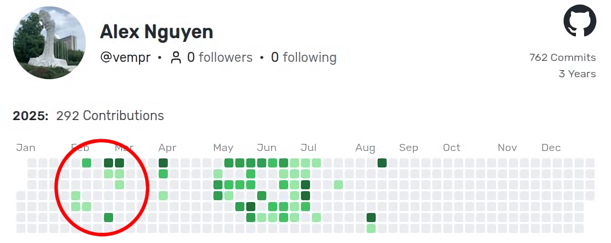

On the 16th of June 2025, I got a newsletter from GitHub:

>  GitHub is joining Hack Club for *Summer of Making* 2025!
> Code this summer to earn incredible prizes: Framework Laptops, Raspberry Pis, Cricut Cutters, Flipper Zeros, Bambu 3D Printers, and so much more.
> Here's how it works:
> 1. Code on personal projects to earn shells
> 2. Spend your shells on prizes from Pis to Pinecils
> 3. Repeat until August 31st

I was already working on [libsim](https://github.com/vempr/libsim), my biggest project at that time, so why not log my time and get some cool prizes along the way?

## Learning PHP

::youtube{url="https://www.youtube.com/watch?v=fw5ObX8P6as"}

I had learnt PHP with Jeffrey Way's amazing beginner course on Laracasts in preparation to build my best project with Laravel. The stack I chose was **Laravel + React + SQLite**, since I felt most comfortable building my UI with React.

Now reflecting on the project, I really should have chosen another database system instead of SQLite for much better scalibility, but it made the deployment very simple.

I wasn't the best at designing beautiful interfaces, so I found a really cool TailwindCSS theme on [tweakcn](https://tweakcn.com).

## The First 25% of libsim

After a long and full period of school happenings, I finally found time to commit to this project. It had been a few months since I learnt PHP and Laravel basics, but I quickly got used to the framework's architecture.

The entirety of May was spent building a solid foundation for the API, with little focus on the frontend. I was not rushing to finish libsim quickly, since I had more than 2 months to finish it before going abroad for 6 weeks. Time went by, and then **Summer of Making** started!

## Accelerating

## Sources
- [Summer of Making Art from GitHub](https://github.blog/news-insights/introducing-hack-clubs-summer-of-making)

